# Stella

<p align="center">
  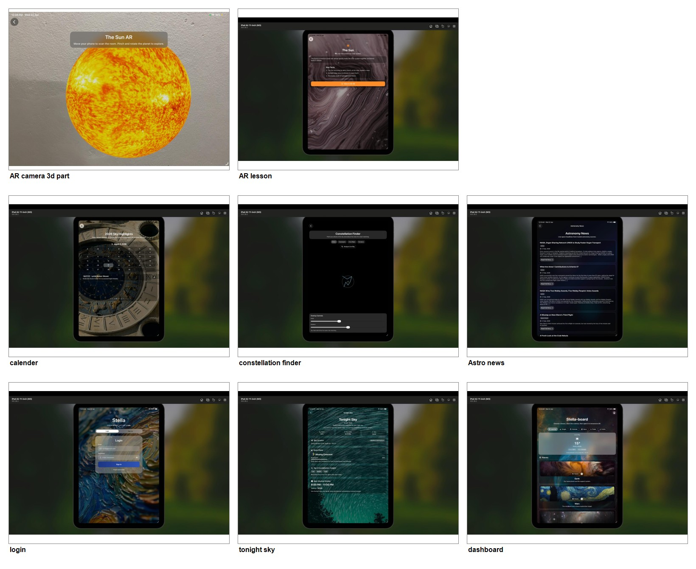
</p>

Stella is an iOS astronomy companion app built with SwiftUI. It combines secure sign-in, a dashboard hub, weather-aware sky planning, live astronomy news, guided learning screens, and immersive AR experiences in one polished app.

## Project Snapshot

| Item | Details |
| --- | --- |
| Platform | iPhone and iPad |
| UI | SwiftUI |
| Authentication | Firebase Authentication |
| Database | Firebase Firestore |
| Live Data | CoreLocation, Open-Meteo, Spaceflight News API |
| Immersive Tech | ARKit, RealityKit, USDZ planet models |
| Team | Two-member academic group project |

## Core Features

| Feature | What it does |
| --- | --- |
| Authentication | Secure sign up, sign in, and password flow with Firebase Authentication. |
| Dashboard Hub | Acts as the home screen and central navigation point for the app. |
| Weather Snapshot | Uses location and live weather data to help users judge sky conditions. |
| Tonight Sky | Summarizes the best viewing window, moon phase, and visible sky information. |
| Celestial Calendar | Organizes astronomy events across the year for easier planning. |
| Constellation Finder | Uses the camera and overlay controls to help identify constellations. |
| AR Lesson | Combines lesson content with immersive AR-based learning. |
| AR 3D Model Viewer | Lets users place and inspect 3D celestial models in their environment. |
| Astronomy News | Shows live astronomy headlines from the Spaceflight News API. |

## Tech Stack

| Area | Tools |
| --- | --- |
| Frontend | SwiftUI, Combine |
| Authentication | FirebaseAuth |
| Database | FirebaseFirestore |
| Location | CoreLocation |
| Weather | Open-Meteo |
| News | Spaceflight News API |
| AR | ARKit, RealityKit |
| Assets | USDZ models, app images, screenshots |

## Setup

1. Open `Stella.xcodeproj` in Xcode.
2. Make sure `GoogleService-Info.plist` matches the Firebase project you want to use.
3. Select an iPhone or iPad run destination.
4. Build and run the app from Xcode.
5. Use a physical device for the AR and camera-based screens.

## Screenshots

<table>
  <tr>
    <td align="center">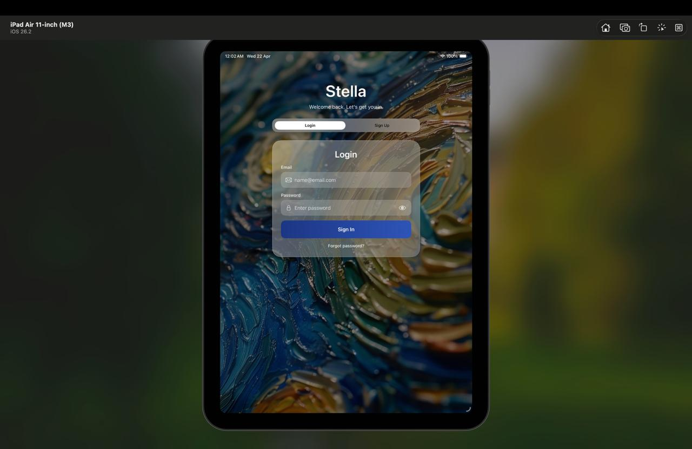<br><sub>Authentication</sub></td>
    <td align="center">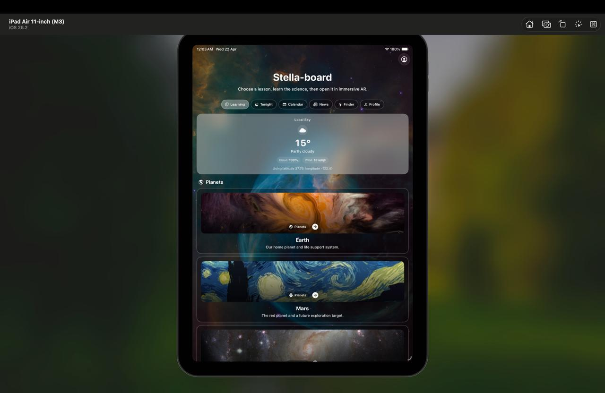<br><sub>Dashboard hub</sub></td>
    <td align="center">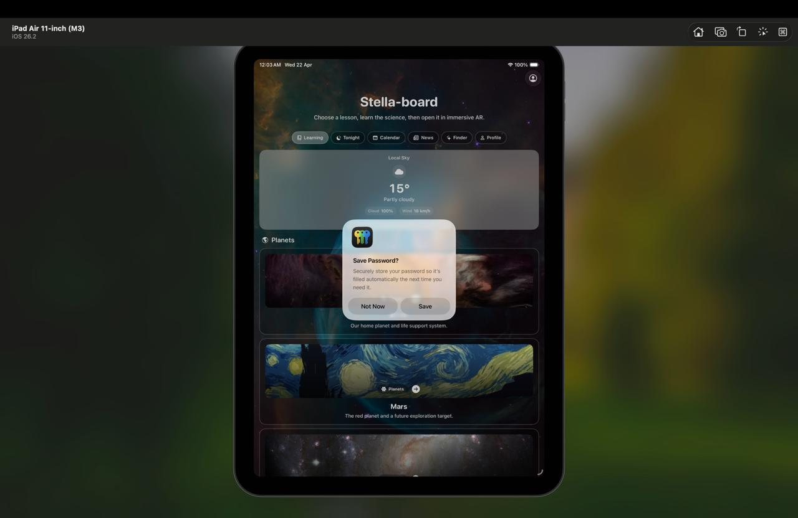<br><sub>Weather snapshot</sub></td>
  </tr>
  <tr>
    <td align="center">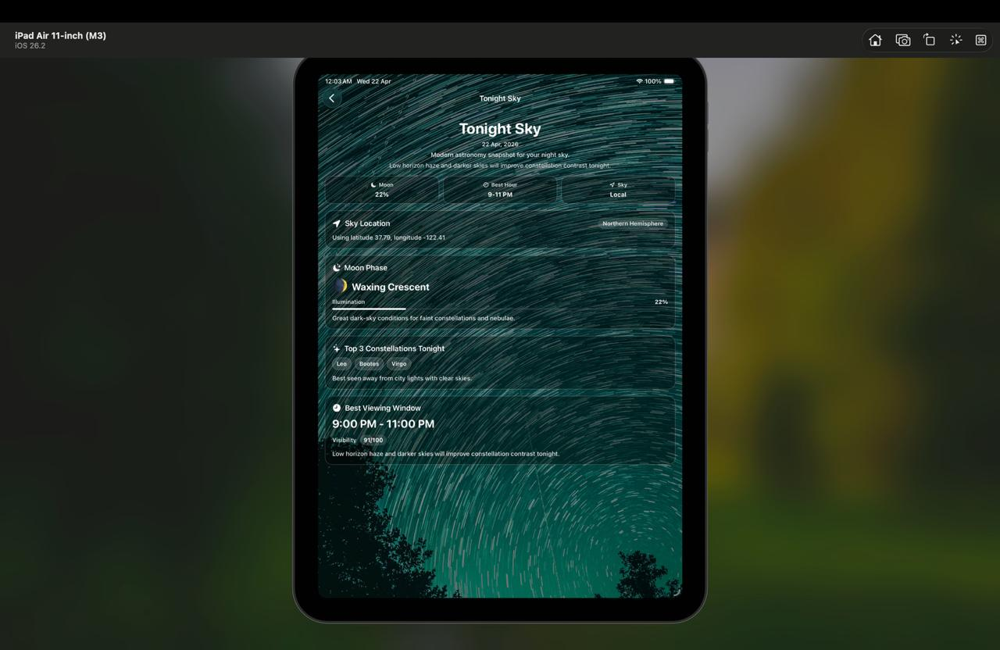<br><sub>Tonight Sky</sub></td>
    <td align="center">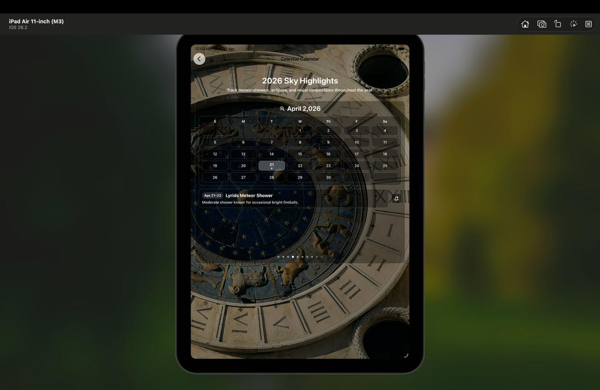<br><sub>Celestial calendar</sub></td>
    <td align="center">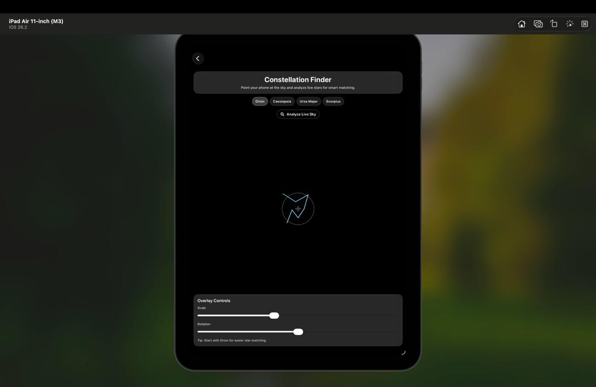<br><sub>Constellation finder</sub></td>
  </tr>
  <tr>
    <td align="center">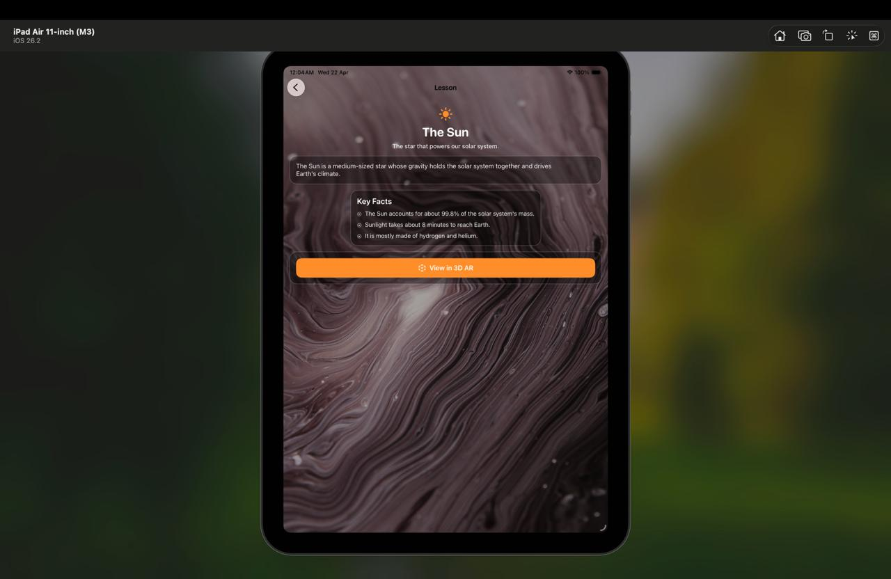<br><sub>AR lesson</sub></td>
    <td align="center">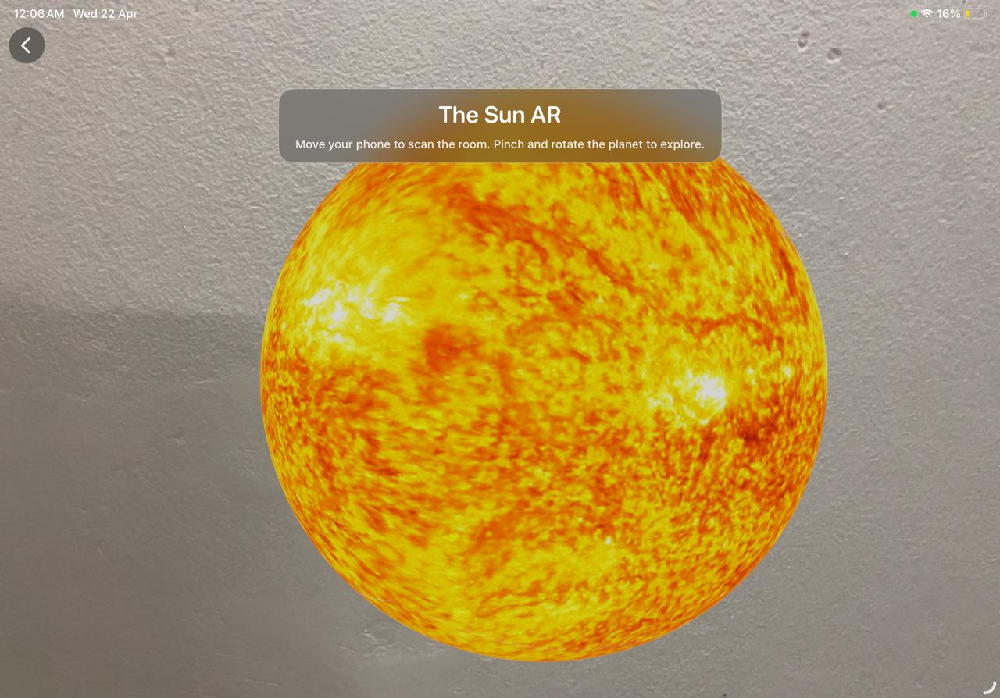<br><sub>AR 3D model</sub></td>
    <td align="center">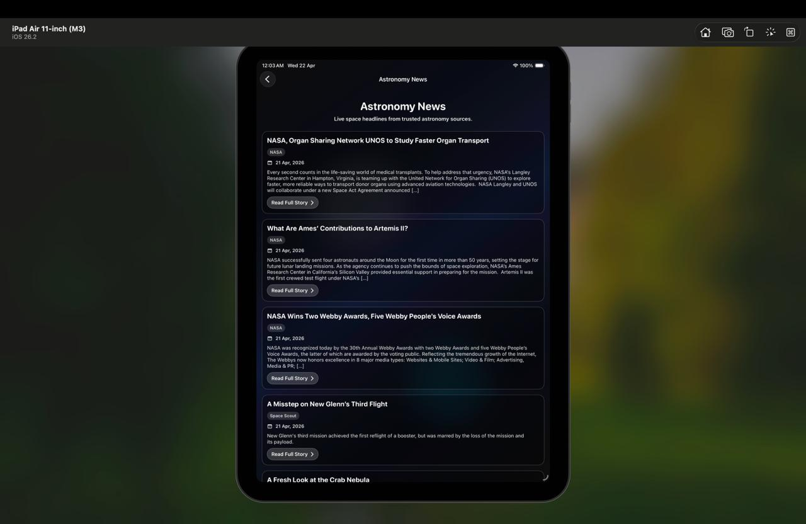<br><sub>Astronomy news</sub></td>
  </tr>
</table>

## Diagrams

### Architecture

<p align="center">
  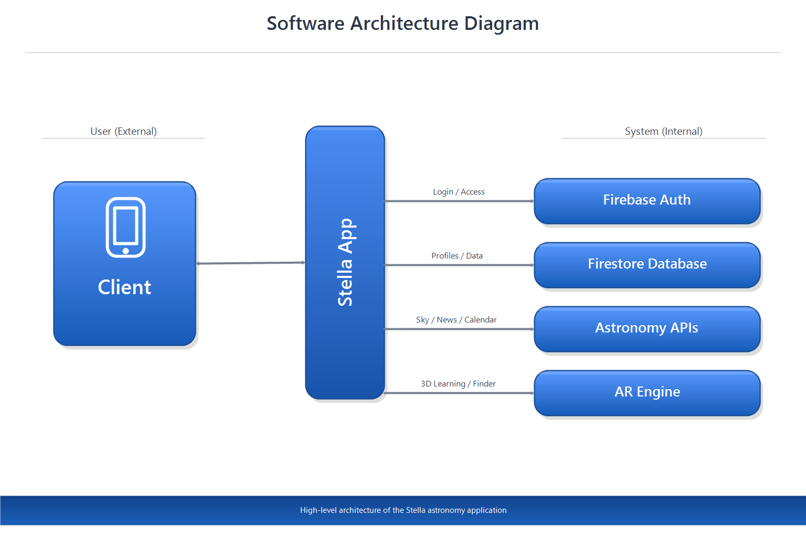
</p>

The architecture keeps the UI, app state, data services, and external APIs separated so the screens stay responsive and easier to maintain.

### Workflow

<p align="center">
  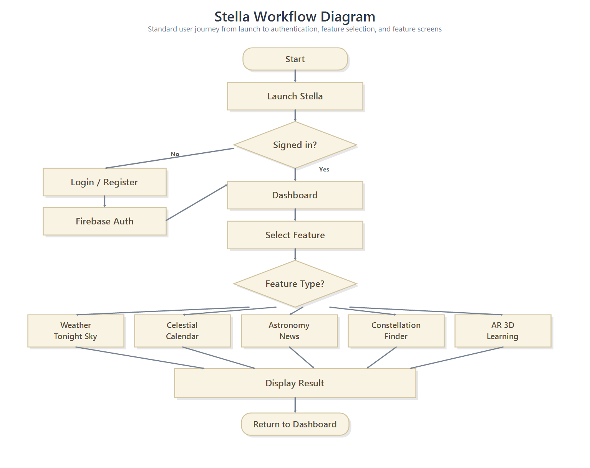
</p>

The workflow starts at login, moves through the dashboard, and routes the user into the relevant sky, AR, calendar, or news feature before returning to the home flow.

## Project Structure

```text
Stella/
+-- Views/
|   +-- Auth/
|   +-- Dashboard/
|   +-- Tonight/
|   +-- Calendar/
|   +-- AR/
|   +-- News/
|   +-- Profile/
+-- Assets.xcassets/
+-- PlanetModels/
+-- ContentView.swift
+-- Item.swift
+-- StellaApp.swift
+-- GoogleService-Info.plist
```

## Permissions And Notes

| Permission / Dependency | Why it matters |
| --- | --- |
| Camera | Used for AR placement and constellation finding. |
| Location | Used for weather and tonight sky guidance. |
| Internet | Required for live weather, Firestore, and news content. |

- AR and camera features work best on a physical device.
- If you change Firebase projects, replace `GoogleService-Info.plist`.
- Live data sources can change content over time.

## Team

Developed as a two-member academic group project.

## License

No explicit license is included. Add one if you plan to publish or reuse the project.
